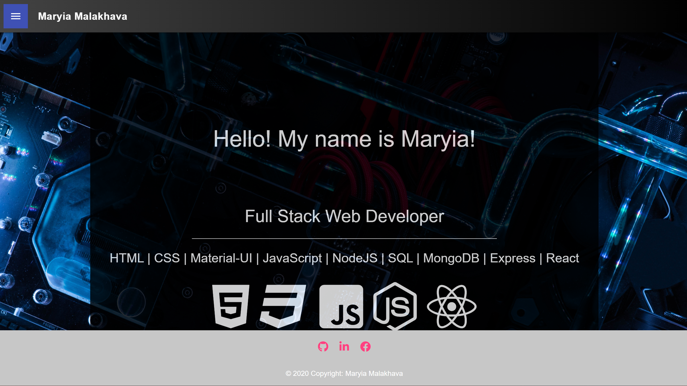
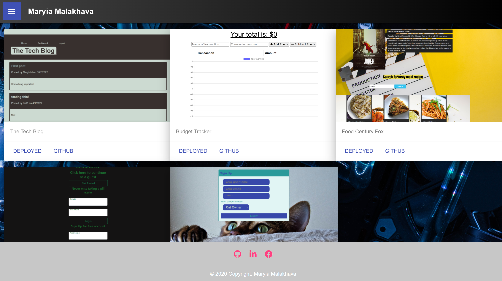
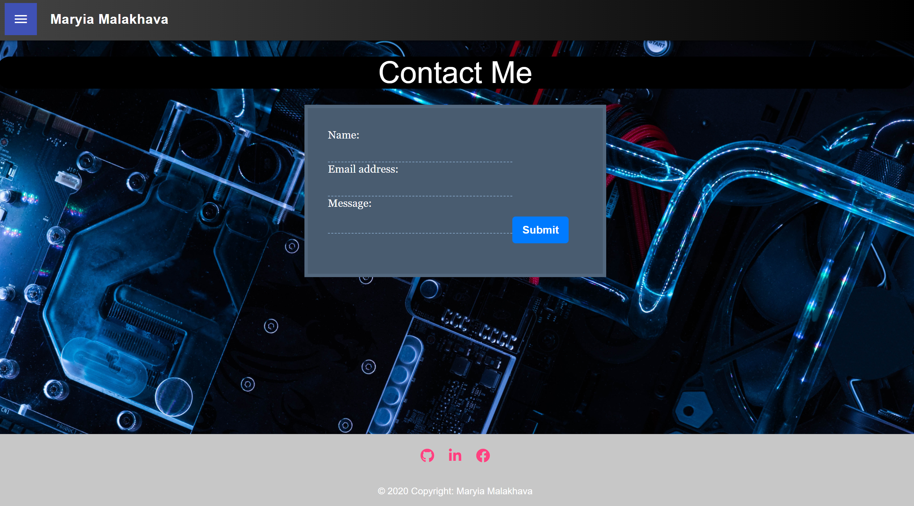

   # My React Portfolio
   ## malakhavam
   
   ## Description 
   
   The application containes my personal portfolio website built with React.js.
   
   ## Table of Contents  
   * [Installation](#installation)
   * [Screenshots](#screenshots)
   * [Contributors](#contibutors) 
   * [License](#license)
   * [Questions](#questions)
   
   
   ## Installation 
   
   The project was uploaded to GitHub at the following repository: https://github.com/malakhavam/maryia-react-portfolio  
   Deployed application access with the Heroku: https://maryia-react-portfolio.herokuapp.com/     
   To install the project follow these steps: 
   * Clone the application from GitHub with: git clone [clone link from GitHub] 
   * From the root folder, install the dependencies with: npm install
   * To run the app locally use: npm start 

   ## Screenshots

   
   
   
   
   
  
   ## Contributors

   N/A

   ## License

   MIT
  
   ## Questions
   
   If you have questions or you want to share comments, we will be glad to hear from you. Please contact me at malakhava@yahoo.com